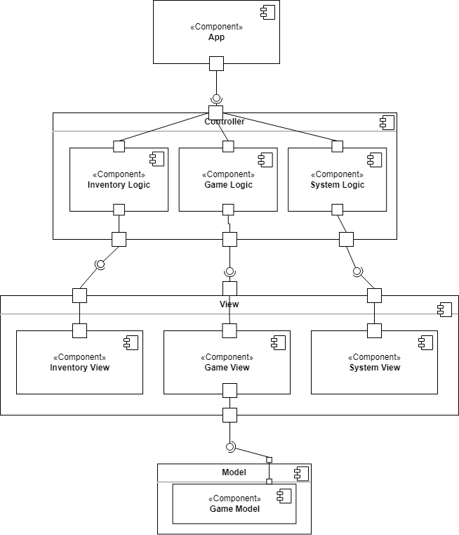
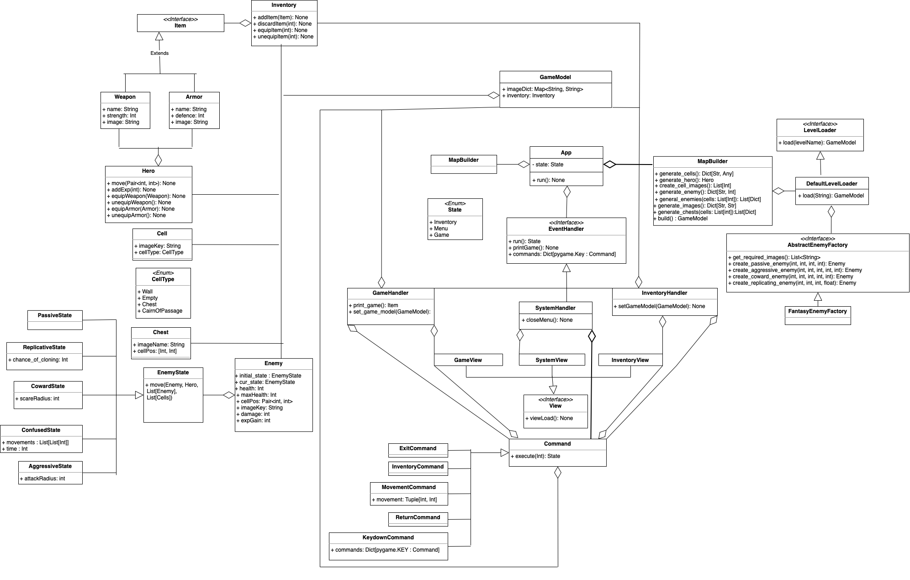
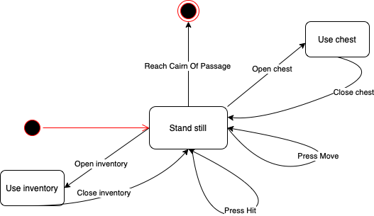
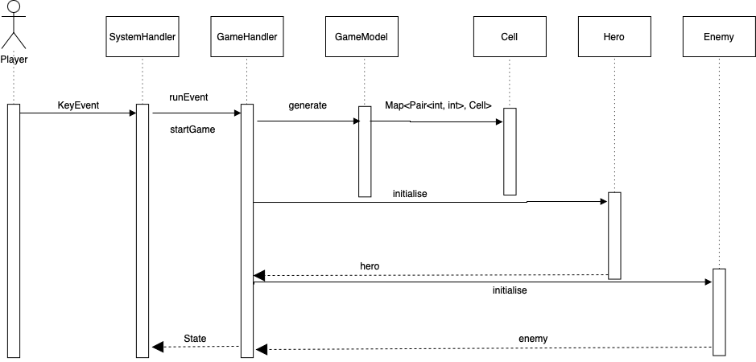

# RogueLike Game
## Разработчики
- Чайкова Анастасия
- Эгипти Павел
- Шелухина Екатерина
- Габитов Даниил

## Общие сведения о системе

Реализация игры, основанной на rogue-like подземелье `Palace of the Dead` из игры FFXIV с консольной графикой. 
`Palace of the Dead` – постоянно меняющееся подземелье, архитектура которого никогда не бывает одинаковой.
Цель `Palace of the Dead` состоит в том, чтобы спускаться по этажам, сражаясь с существами по пути, пока в конечном итоге не достигнете босса, который ждет на нижнем уровне.

### Границы системы

- Поддержка однопользовательского оффлайн-режима
- Консольная графика
- Управление с помощью клавиатуры
- Случайная генерация карт для уровней (количество комнат и расположение противников)

### Контекст системы
- Приложение должно поддерживаться на MacOS, Linux и Windows
- Приложение запускается из терминала пользователя

## Ключевые требования
### Технические ограничения
- Необходима установленная библиотека для работы с консольной графикой
### Бизнес-ограничения
- Время, выделенное на разработку системы - 2 месяца
- Использование open-source библиотек
### Качественные характеристики системы
- Изменяемая система: возможность добавления новых врагов и оружий
- Система не имеет доступа к личным данным пользователя
### Функциональные требования
- Консольная графика
- Управление игрой с помощью клавиатуры
- Игрок управляет одним персонажем
- У персонажа есть:
    - шкала здоровья
    - шкала опыта
    - экипировка
    - оружие (меч, посох, ...)
- Игрок может выбирать разное оружие для сражения
- От вида оружия зависит количество наносимого урона
- Существуют различные виды противников: разный радиус, в котором они замечают персонажа и разное количество наносимого урона за удар
- Персонаж может взаимодействовать с предметами на карте:
    - сундуки, дающие экипировку или оружие
 
## Роли и случаи использования

Роли:
- Игрок
- Разработчик

Случаи использования: 
- Игрок хочет сыграть в одну признанную критиками игру, однако по определенным причинам (недостаточно свободного места на диске, малое количество свободного времени) он не может этого сделать. 
Ему важно, чтобы прохождение игры не занимало много времени, была возможность опробовать различные классы персонажей и чтобы структура уровней навевала приятные воспоминания об оригинальной игре.
- Программисту для добавления новых уровней или врагов хотелось бы потратить минимально возможное количество времени для обретения понимания того, с какой частью кода и как стоит работать, поэтому 
должно присутствовать качественное описание системы и архитектура, позволяющая вести работу только с некоторыми точками расширения

### Описание типичного пользователя


**Имя:** Данил
**Возраст:** 20 лет
Устал делать домашку, хочет отвлечься и отдохнуть. Компьютер Данила обычно настолько сильно нагружен разработкой больших проектов, что запустить игры с хорошей графикой не предоставляется возможности. Именно поэтому Данил выбирает приложения с консольной графикой. Также ему всегда хочется выглядеть крутым программистом, поэтому он во всех возможных случаях пользуется терминалом.


## Композиция

Используется слоистая архитектура, компоненты выделены в соответствии со схемой Model-View-Controller



- **App** - точка входа в приложение, считывает ввод пользователя и передает на дальнейшую обработку
- **Controller:**
  - **Inventory Logic** - обработка ввода пользователя в случае работы с инвентарем
  - **Game Logic** - обработка ввода пользователя во время управления персонажем в ходе игры
  - **System Logic** - обработка ввода пользователя во время работы с меню
- **Model:**
  - **Game Model** - состояние игры
- **View**
  - **Inventory View** - отображение окна с инвентарем
  - **Game View** - отображение текущего игрового процесса
  - **System View** - отображение главного меню игры 

## Логическая структура


- **App** - основное приложение, обрабатывает поступившие от пользователя действия на основе текущего состояния `State` при помощи `EventHandler`
- **EventHandler** - интерфейс, отвечающий за исполнение ввода пользователя
  - **GameHandler** - отвечает за текущее состояние игры (`GameModel`)
  - **SystemHandler** - отвечает за работу с главным меню (`Menu`) - удалить сохраненную игру и прочитать правила игры
  - **InventoryHandler** - отвечает за работу с инвентарем – позволяет надевать/снимать/выбрасывать экиперовку и оружие(`Potion`)
- **GameModel** - хранит все элементы игровой карты: состояние инвентаря, различные виды блоков, вражеских существ и героя
- **LevelLoader** - интерфейс, позволяющий загружать игровые уровни
  - **DefaultLevelLoader** - стандартный загрузчик уровней, преобразующий json файлы, удовлетворяющие некоторому инварианту в игровое состояние (`GameModel`)  
- **MapBuilder** – отвечает за создание карты уровня: либо загружает из json, либо генерирует новую
- **Cell** - хранит расположение клетки на сетке карты, а также ее содержимое (`CellState`)
- **Enemy** - базовый класс, от которого наследуются мобы
  - **PassiveEnemy** - пассивный моб, стоящий все время на месте
  - **CowardEnemy** - трусливый моб, убегающий при приближении героя
  - **AggressiveEnemy** - агрессивный моб, который атакует героя, если он близко
  - **ConfusedEnemy** - моб, находящийся под эффектом конфузии, перемещается, случайно выбирая соседнюю клетку
- **Hero** - хранит информацию о текущем персонаже - уровень здоровья, количество опыта, оружие и его состояние, состояние экипировки и уровень брони
- **Inventory** - хранит собранные персонажем вещи, имеет ограниченную вместимость
- **View** - интерфейс, отвечающий за объекты, которые будут отображаться пользователю  
  - **GameView** - отображение карты, персонажа, врагов и прочего основного процесса игры пользователю
  - **SystemView** - отображение главного меню 
  - **InventoryView** - будет отображать текущий инвентарь
 
## Взаимодействия и состояния
### Диаграмма конечных автоматов – диаграмма прохождения уровня


После загрузки уровня оказываемся в состоянии `Stand still`. 
При нажатии клавиш `WASD` можем тратить ход на перемещение по карте по свободным клеткам. 
При встрече с противником есть возможность атаковать его - для этого надо шагнуть на клетку, занимаемую противником. 
Атака длиться один ход, в этот ход атакует и противник, т.е любая атака сопровождается и ответным ударом. После атаки обновляется состояние героя и противника, если противник умер, то за него начисляется опыт.
Также есть возможность потратить ход на открытие инвентаря персонажа, где находится оружие или экипировка.
При надевании вещи из инвентаря улучшаются соответствующие характеристики (состояние брони, оружия или здоровья).
Уровень считается пройденным, как только персонаж добрался до клетки с выходом (`Cairn of passage`)

### Диаграмма последовательностей - диаграмма начала игрового процесса


Пользователь(`Player`) своим действием на клавиатуре создает `KeyEvent`(в данном случае выбор элемента из меню), `SystemHandler` распознает это действие как начало игры(`startGame`). Далее вызывается компонента, отвечающая за состояние игры(`GameHandler`). Она в свою очередь занимается загрузкой уровня (`GameModel`), инициализацией персонажа (`Hero`) и его врагов (`Enemy`).
Вся полученная `GameHandler'ом` информация хранится в `GameModel`, так как именно там хранится информация о типе каждой из клеток (`Cell`).


### Выбор вреймворка
При выборе библиотеки для создания игры на Python были отобраны 3 варианта: Pygame, Arcade, Cocos2d. 
Обращалось внимание на качество документации, гайдов и уроков, на удобство написания кода и на уже созданные игры.
Pygame - это проверенная временем бесплатная и open-source библиотека. За время ее существования появилось много уроков и гайдов по ее изучению, большое количество красивых игр.
Arcade - это современная библиотека для создания игр. Arcade и Pygame очень похожи друг на друга: похожая функциональность, иногда кажется, что различия только в названиях классов и методов. Но есть и что-то новое, чего еще нет в Pygame.
Cocos2d - это фреймворк для создания 2D-игр, демонстраций и других графических/интерактивных приложений. Слабая документация - на официальном сайте ссылка с документацией ведет в никуда.
Мы остановились на Pygame в силу его проверенности и наличия довольно хорошей документации.

### Как запустить
```
# install the required packages
pip install -r requirements.txt

# run CLI app 
python3 -m src.app

# run tests
pytest
```