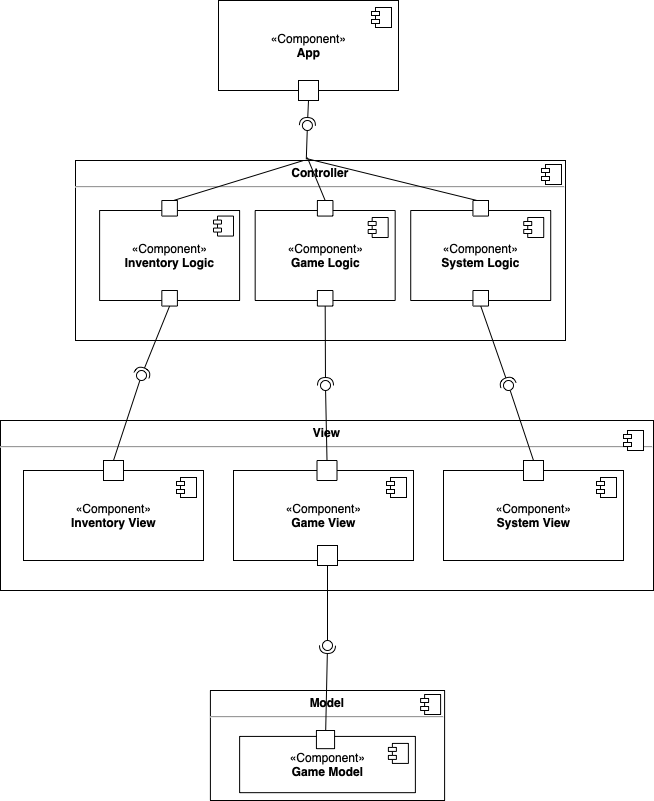

# RogueLike Game
## Разработчики
- Чайкова Анастасия
- Эгипти Павел
- Шелухина Екатерина
- Габитов Даниил

## Общие сведения о системе

Реализация игры, основанной на подземелье Palace of the dead из FFXIV с консольной графикой
### Границы системы

- Поддержка однопользовательского оффлайн-режима
- Консольная графика
- Управление с помощью клавиатуры
- Главное меню:
    - два слота для сохранения текущего прогресса
    - описание текущего состояния экипировки и оружия
    - краткая инструкция по игре

- Случайная генерация карт для уровней (количество комнат и расположение противников)
- Помимо игрового поля на экране отображаются панели с текущими состояниями экипировки, оружия, здоровья, а также
  инвентарь

### Контекст системы
- Приложение должно поддерживаться на MacOS, Linux и Windows
- Приложение запускается из терминала пользователя

## Ключевые требования
### Технические ограничения
- Необходима установленная библиотека для работы с консольной графикой
### Бизнес-ограничения
- Время, выделенное на разработку системы - 2 месяца
- Использование open-source библиотек
### Качественные характеристики системы
- Изменяемая система: возможность добавления новых врагов и оружий
- Не требуется высокая производительность за счет использования консольной графики
- Система не имеет доступа к личным данным пользователя
### Функциональные требования
- Консольная графика
- Управление игрой с помощью клавиатуры
- Игрок управляет одним персонажем
- У персонажа есть:
    - шкала здоровья
    - экипировка
    - оружие (меч, посох, пистолет, ...)
- Игрок может выбрать в начале игры разное оружие для сражения
- От вида оружия зависит радиус поражения, время удара (cast time) и количество наносимого урона
- Существуют различные виды противников: разный радиус, в котором они замечают персонажа и разное количество наносимого урона за удар
- За убийство противников может с некоторой вероятностью выпасть зелья для лечения здоровья
- Персонаж может взаимодействовать с предметами на карте:
    - сундуки, дающие зелья, которые улучшают экипировку, оружие или здоровье
- Сохранение только после 5-го уровня
- Игра состоит из 10 уровней:
    - Первые 9 уровней – карта состоит из нескольких комнат с некоторым количеством противников
    - Последний уровень – одна комната с противником-боссом


## Роли и случаи использования

Роли:
- Игрок
- Разработчик

Случаи использования: 
- Игрок хочет сыграть в одну признанную критиками игру, однако по определенным причинам (недостаточно свободного места на диске, малое количество свободного времени) он не может этого сделать. 
Ему важно, чтобы прохождение игры не занимало много времени, была возможность опробовать различные классы персонажей и чтобы структура уровней навевало приятные воспоминания об оригинальной игре.
- Программисту для добавления новых уровней или врагов хотелось бы потратить минимально возможное количество времени для обретения понимания того, с какой частью кода и как стоит работать, поэтому 
должно присутствовать качественное описание системы и архитектура, позволяющая вести работу только с некоторыми точками расширения

### Описание типичного пользователя


**Имя:** Данил
**Возраст:** 20 лет
Устал делать домашку, хочет отвлечься и отдохнуть. Компьютер Данила обычно настолько сильно нагружен разработкой больших проектов, что запустить игры с хорошей графикой не предоставляется возможности. Именно поэтому Данил выбирает приложения с консольной графикой. Также ему всегда хочется выглядеть крутым программистом, поэтому он во всех возможных случаях пользуется терминалом.


## Композиция

Используется слоистая архитектура, компоненты выделены в соответствии со схемой Model-View-Controller



- **App** - точка входа в приложение, считывает ввод пользователя и передает на дальнейшую обработку
- **Controller:**
  - **Inventory Logic** - обработка ввода пользователя в случае работы с инвентарем
  - **Map Logic** - обработка ввода пользователя во время управления персонажем в ходе игры
  - **System Logic** - обработка ввода пользователя во время работы с меню
- **Model:**
  - **Inventory Model** - состояние инвентаря
  - **Map Model** - состояние игрового поля
- **View**
  - **Inventory View** - отображение окна с инвентарем
  - **Map View** - отображение текущего игрового процесса
    - **System View** - отображение главного меню игры 

## Логическая структура


- **App** - основное приложение, обрабатывает поступившие от пользователя действия на основе текущего состояния `State` при помощи `EventHandler`
- **EventHandler** - интерфейс, отвечающий за исполнение ввода пользователя
  - **GameHandler** - отвечает за текущее состояние игры (`GameModel`)
  - **SystemHandler** - отвечает за работу с главным меню (`Menu`) - позволяет загрузить сохраненную игру(`SaveSlot`), удалить сохраненную игру и прочитать правила игры
  - **InventoryHandler** - отвечает за работу с инвентарем – позволяет использовать различные виды зелий(`Potion`)
- **GameModel** - хранит все элементы игровой карты: различные виды блоков, вражеских существ и героя
- **LevelLoader** - интерфейс, позволяющий загружать игровые уровни
  - **DefaultLevelLoader** - стандартный загрузчик уровней, преобразующий json файлы, удовлетворяющие некоторому инварианту в игровое состояние (`GameModel`)  
- **Entity** - базовый класс, от которого наследуется любой отображаемый на игровом экране обьект
  - **Cell** - хранит расположение клетки на сетке карты, а также ее содержимое (`CellState`)
  - **Enemy** - класс, отвечающий за противников игрока - хранит радиус детектирования персонажа и уровень урона
  - **Hero** - хранит информацию о текущем персонаже - оружие и его состояние, уровень здоровья и состояние экипировки
- **SaveSlot** - хранит сохраненные игры - последний уровень и оружие, которым пользовался персонаж
- **Inventory** - хранит накопленные персонажем зелья, имеет ограниченную вместимость
- **View** - интерфейс, отвечающий за объекты, которые будут отображаться пользователю  
  - **GameView** - отображение карты, персонажа, врагов и прочего основного процесса игры пользователю
  - **SystemView** - отображение главного меню 
  - **InventoryView** - отображение текущего инвентаря
 
## Взаимодействия и состояния
### Диаграмма конечных автоматов – диаграмма прохождения уровня


После загрузки уровня оказываемся в состоянии `Stand still`. 
При нажатии клавиш `WASD` можем тратить ход на перемещение по карте по свободным клеткам. 
При встрече с противником есть возможность атаковать его - для этого нажать соответствующую кнопку и, если противник окажется в радиусе действия оружия персонажа, начать атаку. 
Атака может длиться несколько ходов, в эти ходы обновляется карта, а именно положение противника, а также состояние героя, в том случае если противник начал атаковать персонажа.
Также есть возможность потратить ход на открытие инвентаря персонажа, где находятся зелья, которые персонаж может найти в сундуках, раскиданных по карте.
При использовании зелья из инвентаря улучшаются соответствующие характеристики (состояние брони, оружия или здоровья).
Уровень считается пройденным, как только персонаж добрался до клетки с выходом (`Cairn of passage`)

### Диаграмма последовательностей - диаграмма начала игрового процесса


Пользователь(`Player`) своим действием на клавиатуре создает `KeyEvent`(в данном случае выбор элемента из меню), `SystemHandler` распознает это действие как начало игры(`startGame`). Далее вызывается компонента, отвечающая за состояние игры(`MapHandler`). Она в свою очередь занимается генерацией поля (`Map`), инициализацией персонажа (`Hero`) и его врагов (`Enemy`).
Вся полученная `MapHandler'ом` информация хранится в `Map`, так как именно там хранится информация о типе каждой из клеток (`Cell`).


### Выбор вреймворка
При выборе библиотеки для создания игры на Python были отобраны 3 варианта: Pygame, Arcade, Cocos2d. 
Обращалось внимание на качество документации, гайдов и уроков, на удобство написания кода и на уже созданные игры.
Pygame - это проверенная временем бесплатная и open-source библиотека. За время ее существования появилось много уроков и гайдов по ее изучению, большое количество красивых игр.
Arcade - это современная библиотека для создания игр. Arcade и Pygame очень похожи друг на друга: похожая функциональность, иногда кажется, что различия только в названиях классов и методов. Но есть и что-то новое, чего еще нет в Pygame.
Cocos2d - это фреймворк для создания 2D-игр, демонстраций и других графических/интерактивных приложений. Слабая документация - на официальном сайте ссылка с документацией ведет в никуда.
Мы остановились на Pygame в силу его проверенности и наличия довольно хорошей документации.

### Как запустить
```
# install the required packages
pip install -r requirements.txt

# run CLI app 
python main.py

# run tests
pytest
```
